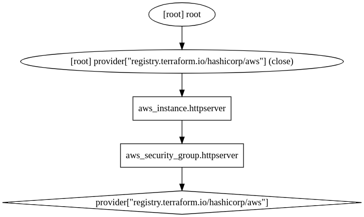

# Hello Word! HTTP Server

```sh
 #!/bin/bash
echo "Hello, World" > index.html
nohup busybox httpd -f -p 8080 &
```

* The reason this example uses port 8080, rather than 80, is that listening on any port less than 1024 requires root user privileges.


```sh
provider "aws" {
  region = "us-east-1"
}
resource "aws_instance" "httpserver" {
  ami                    = "ami-08c40ec9ead489470"
  instance_type          = "t3.nano"
  vpc_security_group_ids = [aws_security_group.httpserver.id]

  user_data = <<-EOF
                #!/bin/bash
                echo "Hello, World" > index.html
                nohup busybox httpd -f -p 8080 &
                EOF

  tags = {
    Name = "httpserver"
  }
}


resource "aws_security_group" "httpserver" {
  name = "httpserver"

  ingress {
    from_port   = 8080
    to_port     = 8080
    protocol    = "tcp"
    cidr_blocks = ["0.0.0.0/0"]
  }
}
```

**user_data_replace_on_change** parameter is set to true so that when you change the user_data parameter and run apply, Terraform will terminate the original instance and launch a totally new one. Terraform’s default behavior is to update the original instance in place, but since User Data runs only on the very first boot, and your original instance already went through that boot process, you need to force the creation of a new instance to ensure your new User Data script actually gets executed.


**aws_security_group** specifies that this group allows incoming TCP requests on port 8080 from the CIDR block 0.0.0.0/0. CIDR blocks are a concise way to specify IP address ranges. For example, a CIDR block of 10.0.0.0/24 represents all IP addresses between 10.0.0.0 and 10.0.0.255. The CIDR block 0.0.0.0/0 is an IP address range that includes all possible IP addresses, so this security group allows incoming requests on port 8080 from any IP


Simply creating a security group isn’t enough; you need to tell the EC2 Instance to actually use it by passing the ID of the security group into the **vpc_security​_group_ids** argument of the **aws_instance** resource

To access the ID of the security group resource, you are going to need to use a resource attribute reference: **aws_security_group.httpserver.id**, which uses the  syntax:  ```<PROVIDER>_<TYPE>.<NAME>.<ATTRIBUTE> ```  


When you add a reference from one resource to another, you create an implicit dependency. Terraform parses these dependencies, builds a dependency graph from them, and uses that to automatically determine in which order it should create resources.

You can even get Terraform to show you the dependency graph by running:


```sh
terraform graph
```


The output is in a graph description language called DOT, which you can turn into an image, by using a desktop app such as [Graphviz](https://bit.ly/2mPbxmg)



Since the plan looks good, enter :

```sh
terraform apply
```

Then click your new Instance, you can find its public IP address in tab Networking, to test the server execute: <br>
```curl http://<EC2_INSTANCE_PUBLIC_IP>:8080```